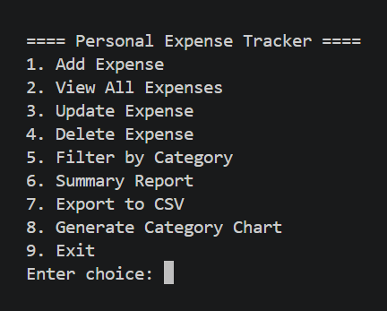
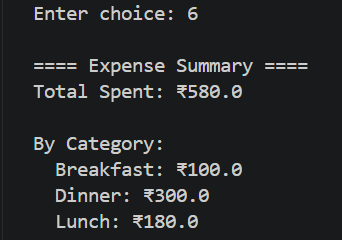
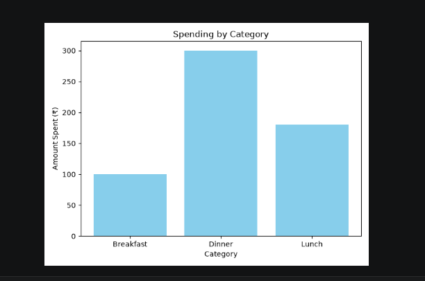

# Personal Expense Tracker

A command-line application built in Python to track, manage, and analyze personal expenses using a SQLite database for persistent storage.

## Problem It Solves

Manually tracking expenses in spreadsheets is unstructured and error-prone. This tool provides validated data entry, instant filtering, and summary reports — turning scattered spending data into clear insights.

## Features

- Add expenses with amount, category, date, and optional notes
- View all expenses sorted chronologically
- Update or delete existing expense records
- Filter expenses by category
- Generate a summary report (total spent, spending by category)
- Export all expenses to a CSV file
- Visualize spending by category as a bar chart

## Tech Stack

- **Language:** Python 3
- **Database:** SQLite (via Python's built-in `sqlite3` module)
- **Libraries:** `matplotlib` (data visualization)

## Project Structure

personal-expense-tracker/
├── main.py # Entry point — CLI menu and user interaction
├── database.py # All SQLite database operations
├── expense_manager.py # Business logic and input validation
├── models.py # Expense data model
├── report.py # Summary reports, CSV export, chart generation
├── utils.py # Validation helper functions
├── requirements.txt # Project dependencies
└── README.md


## Installation

1. Clone the repository
```bash
git clone https://github.com/jadhavnilesh9021-byte/personal-expense-tracker.git
cd personal-expense-tracker
```

2. Install dependencies
```bash
pip install -r requirements.txt
```

3. Run the application
```bash
python main.py
```

## Usage

Run the program and select options from the menu:

==== Personal Expense Tracker ====

Add Expense
View All Expenses
Update Expense
Delete Expense
Filter by Category
Summary Report
Export to CSV
Generate Category Chart
Exit

## Screenshots

## Screenshots

**Main Menu**


**Viewing Expenses**


**Summary Report**


**Category Spending Chart**


## Future Improvements

- Migrate from CLI to a Flask REST API for web/mobile accessibility
- Add user authentication for multi-user support
- Support monthly/yearly budget limits with alerts
- Add unit tests using `pytest`
- Refactor shared validation logic between add/update into a single helper

## Learning Outcomes

- Designing a layered architecture with separation of concerns (UI, business logic, data layer)
- Working with SQLite databases using Python's `sqlite3` module
- Implementing input validation and custom exception handling
- Using `matplotlib` for basic data visualization
- Structuring a Python project for readability and maintainability

## License

This project is licensed under the MIT License.